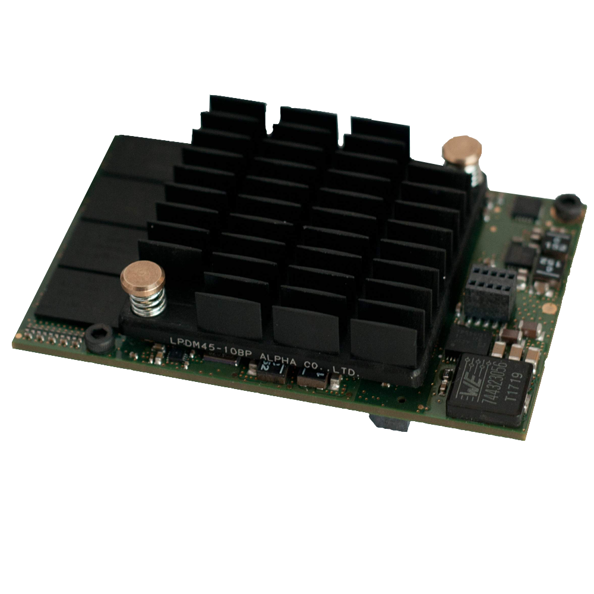
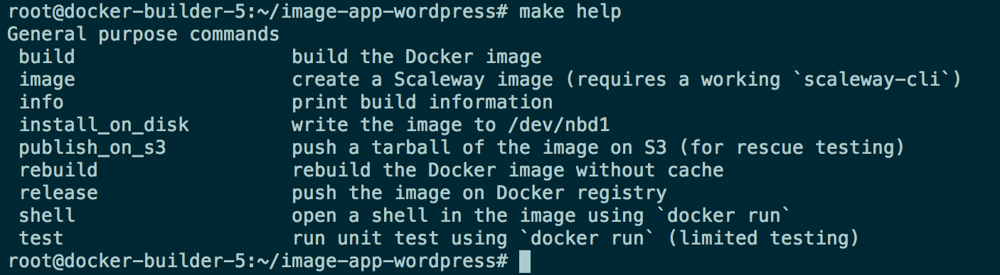

footer: While42 Paris - by [@moul](https://twitter.com/moul) & [@aimxhaisse](https://twitter.com/aimxhaisse)
slidenumbers: true

# [fit] Building images for **Scaleway**


---




# Who We Are

- BareMetal SSD cloud servers
- Compute C1
  - 4 dedicated ARM cores
  - 2GB memory
  - 50GB SSD Disk
  - 1 public IPv4 address
  - 200Mbits/s unmetered bandwidth

---


---

# Example of images

- *distrib images*: Ubuntu, Debian, Fedora, Arch Linux, Gentoo, Alpine Linux ...
- *1-Click apps*: Docker, Wordpress, OwnCloud, Pydio, LEMP, Python, Node.js ...

--

*coming soon*: community images


---

# Our Needs

- *write*/*build*/*test*/*commit* images
- Encourage *contributions*

---

# The Docker Way

1. inherit from a Docker image
  *FROM my-arm-image*
2. customize
  *RUN apt-get install ...*
3. convert it to Scaleway image
  *$ make build*


---

# *Hello World* Dockerfile

```bash
# Inherit from the Ubuntu Trusty Scaleway image
FROM armbuild/scw-distrib-ubuntu:trusty

# Install the `cowsay` package
RUN apt-get install -y -qq cowsay

# Add local assets
COPY ./patches/ /
```

---


# Let's Build

### `$ make image`

```bash
docker build && docker run && docker export
```
- spawns a C1 instance, export tarball to the volume and snapshot

---

1. port a Docker image to *ARMHF*[^1]
[^1]: to list the ported Docker images, run: `docker search armbuild/`

3. **only for distrib images**: customize/enable init scripts[^2]
[^2]: Docker images are built to run apps, not systems, we need to (re)enable init scripts.


---

# Pros :ok_hand:

### can port existing images from community

```bash
sed -i 's/^FROM .*$/FROM armbuild/scw-distrib-ubuntu:trusty/' Dockerfile
```

---



# Pros :ok_hand:

### benefit from *Docker*/*Dockerfile* features

- *inheritance*: images apps are simple and concise
- *caching*: incrementally build your images
- *debug*: drop a shell in the future image thanks to `docker run`
- *pull/push*: sources are on GitHub, builds are on registries

---


# Pros :ok_hand:

### easy to contribute

- *Dockerfile* known standard
- **sources** & **issues** on *GitHub*

```
$ nano Dockerfile
$ git commit -am 'Added cool feature. :neckbeard:'
```

---

# Cons

- no official support of Docker on ARM
- some applications aren't ARM-ready
- no crossbuild

---

# Questions?

scaleway.com
github.com/scaleway
twitter.com/scaleway
